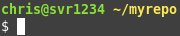
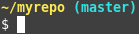
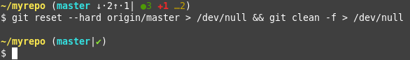

## Set Bash Prompt for account
```bash
# add to `~/.bashrc`, replacing <new prompt> with prompt from below
DEFAULT_PS1=$PS1
PS1=<new prompt>
# Note - for the Git prompt, you will need to add \ before each `
```
## Servers

```bash
export PS1="\n\[\e[01;32m\]\u@\h\[\e[m\] \[\e[01;33m\]\w\[\e[m\]\n$ "
```

## Development machines

```bash
export PS1="\n\[\e[01;33m\]\w\[\e[m\]\[\033[01;36m\]`__git_ps1`\[\033[0m\]\n$ "

# To set the terminal window title to the current working directory
export PS1='\[\033]0;${PWD//[^[:ascii:]]/?}\007\]\n\[\033[01;33m\]\w\[\033[01;36m\]`__git_ps1`\[\033[0m\]\n$ '
```

## Awesome Git Prompt

```bash
# Clone Repo`
git clone https://github.com/magicmonty/bash-git-prompt ~/.bash-git-prompt

# Add to ~/.bashrc
GIT_PROMPT_ONLY_IN_REPO=1
GIT_PROMPT_START="\n\[\e[01;33m\]\w\[\e[m\]\[\033[0m\]"
GIT_PROMPT_PREFIX="("
GIT_PROMPT_SUFFIX=")"
GIT_PROMPT_END="\n$ "
GIT_PROMPT_SYMBOLS_PREHASH="commit:"
GIT_PROMPT_BRANCH="\[\033[01;36m\]" # Change from magenta to Bold Cyan
GIT_PROMPT_COMMAND_FAIL='\[\033[1;31m\]✘-_LAST_COMMAND_STATE_' # Change from red to bold red
# Make same as .gitconfig colors
GIT_PROMPT_STAGED=' \[\033[0;32m\]●' # Change from red to green
GIT_PROMPT_CONFLICTS=' \[\033[1;31m\]✖' # Change from red to bold red
GIT_PROMPT_CHANGED=' \[\033[1;31m\]✚' # Change from blue to bold red
GIT_PROMPT_UNTRACKED=' \[\033[0;33m\]…' # Change from cyan to yellow
# My New Values
GIT_PROMPT_SYMBOLS_PRETAG="tag:"
GIT_PROMPT_DETACHED_HEAD="\[\033[1;35m\]" # Set to [Bold Magenta]
source ~/.bash-git-prompt/gitprompt.sh

# NOTE: Update .gitconfig colors to match prompt colors
```

## Reference
#### Create custom Bash prompts
http://ezprompt.net/
